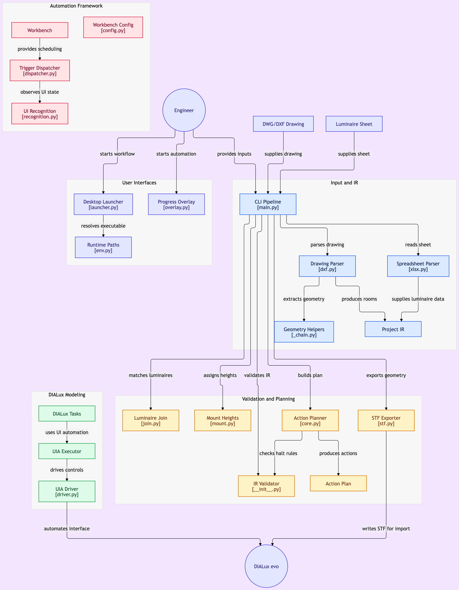

# dialux-compiler

> 一套 Windows 桌面自动化框架，用于驱动**没有 API 的专业软件**。
> DIALux 是第一个落地用例。



## 它能解决什么问题

很多专业软件没有 API，只有 GUI。想自动化它们，传统做法是三选一：

| 做法 | 问题 |
|---|---|
| 纯坐标点击 | 窗口一动就失灵 |
| 图像识别 | 慢、脆、难维护 |
| 人工操作 | 慢，且不可复现 |

**本项目走第四条路：以 UIA 元素树为主，坐标/OCR 为辅，把「操作」抽象成可计划、可重放的动作序列。**

## 两件事可以直接拿去用（不依赖 DIALux）

### 1. 通用自动化工作台 `src/workbench/`

Task / Trigger / Flow / Config / Dispatcher 五件套。
**换一个目标软件，换掉 task 层就行。**

### 2. UIA 执行器 `src/executor/uia/`

PowerShell UIA + Win32 窗口消息 + SendInput。
**任何 Windows 桌面软件的自动化都能用它。**

## DIALux 用例 `src/tasks/dialux/`

主链路：DWG/PDF/Excel → 解析器 → IR(JSON) → 规则引擎 → 动作计划 → 执行器 → 建模 + 计算报告

**跑这个用例需要 DIALux evo 14.0**（专有软件，需自行获取）。

## 快速开始

```bash
pip install -r requirements.txt
python -m pytest tests/ -v

# 解析示例图纸 → IR → STF（无需 DIALux，纯文件链路）
python src/main.py --dwg tests/fixtures/sample_room.dxf --dwg-lighting tests/fixtures/sample_lighting.dxf --config tests/fixtures/sample_parse_config.json --out build/demo_ir.json --preview
python -m src.exporter.stf --validate build/demo_ir.json build/demo_out.stf
```

有 DIALux evo 时（先打开 DIALux，再跑）。默认读取仓库根目录的 `布局图.dwg` / `灯具图.dwg`；
手头没有图纸时，可用仓库自带样例：

```bash
# 解析 → 建立房间 → 导入灯具型号 → 排布 → 存盘，一条龙
python scripts/demo_run.py --dwg tests/fixtures/sample_room.dxf --dwg-lighting tests/fixtures/sample_lighting.dxf --luminaires auto
python scripts/demo_run.py --dwg tests/fixtures/sample_room.dxf --dwg-lighting tests/fixtures/sample_lighting.dxf --no-drive    # 只出 STF，不碰 DIALux
```

## 实测状态

- 250 个测试：干净 clone 247 passed / 3 skipped（跳过项为缺 build/ 运行产物；2026-10-09 复核）
- DIALux evo 14.0 真机跑通：菜单导航 → 文件对话框 → 导入 → 保存
- 房间几何通过 STF 落地，顶点回环 11/11
- **STF 默认写 GBK/CP936**（2026-10-08 真机结论）：DIALux 按 CP936 读文本，写 UTF-8 会让中文房名变乱码；
  `write_stf()` 默认已改，CLI 加 `--encoding` 可覆盖
- **灯具链路（2026-10-08 更正）**：STF 的灯具段导入后以占位符**完整保留**（36/36 实测），
  可在 DIALux UI 批量替换为真灯并参与照度计算；另经「Luminaire Finder → Dx 送到 DIALux」通道
  可带真实数据直接入库。早期记录的「DIALux 完全忽略灯具段」已过时。

## 环境要求

- Windows（UIA 是 Windows 专属）
- Python 3.11
- 可选：DIALux evo 14.0（只跑 DIALux 用例时需要）

## 文档

- 架构说明：`docs/architecture.md`
- 状态板（进度 / 验收证据 / 门禁数字）：`KANBAN.md`
- **DIALux 操作知识库（203 篇官方 KB 离线包）**：`docs/dialux-kb/DIALux_evo_官方KB_EN/README.md`
  —— 真机操作遇卡点先查它，查不到再动手试；试出来的新路径回写到该目录，不要只留在会话里
- IR 契约：`spec/ir.schema.json`
- 计划与调研：`docs/plan-*.md`、`docs/reference-dialux-ecosystem.md`

## 架构灵感

工作台架构参照 [BetterGI](https://github.com/babalae/better-genshin-impact)（GPL-3.0）。
**本项目为独立实现，未复制其代码**；架构层面的借鉴在此声明。

## License

[MIT](LICENSE)
